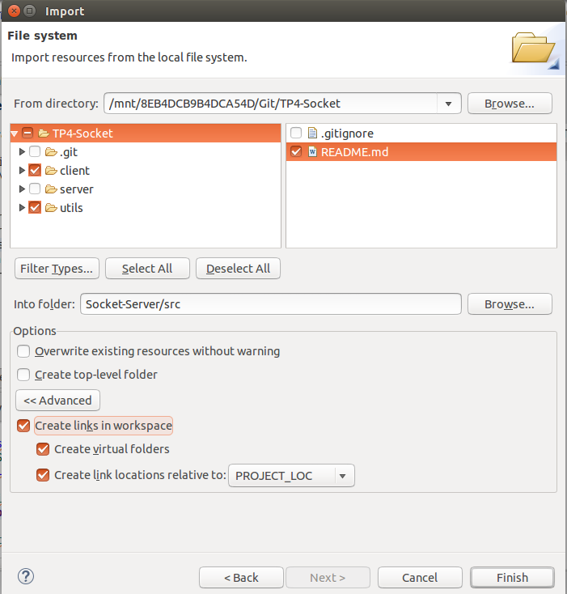

# TP4-Socket

## Estructura de trabajo
Para trabajar en eclipse, se debio crear 2 proyectos, debido a que eclipse no te permite tener dos "main" en un solo proyecto, a continuación solo mostraremos como se crea el proyecto CLIENTE, ya que luego para crear el proyecto SERVIDOR, los pasos son muy parecidos.

1 : Crear un nuevo proyecto C con linux GCC.
2 : Crear un nuevo "source folder" dentro del proyecto con nombre "src".
3 : Importamos dentro de la carpeta src, un File System, que en el caso del cliente seria de la siguiente manera:  

Se debe importar:

* La carpeta client, que contiene toda la logica del cliente.
* La carpeta utils que contiene archivos que son compartidos entre el cliente y el servidor.
* El archivo README.md para su compartir información del grupo.

Por ultimo de debe chequear crear links, para que las carpetas esten enlazadas al proyecto y no se realice una copia de estas en el proyecto.

Ahora, para crear el proyecto SERVIDOR solo se debe repetir los mismos pasos, cambiando la seleccion de la carpeta client, por la carpeta server.

## Documentacion de Sockets API
 
[http://www.on-time.com/rtos-32-docs/rtip-32/reference-manual/socket-api/sendto.htm](http://www.on-time.com/rtos-32-docs/rtip-32/reference-manual/socket-api/sendto.htm)
